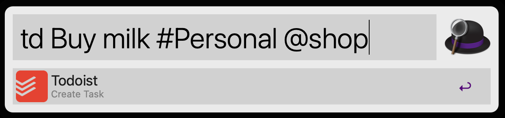

# tadd

Single binary, no dependency, utility to quickly create [Todoist](https://todoist.com/app/today) task. 

> Todoist has a quick add app, but if you already are a user of productivity apps like [Alfred](https://www.alfredapp.com/) on Mac, or just prefer a quicker way of collecting tasks right from the terminal without switching context, `tadd` is for you.

## install 

### using Homebrew

```shell
brew tap mchmarny/tadd
brew install tadd
```

All new release will be automatically picked up with `brew upgrade`

### using Alfred

Download and install the latest `tadd.alfredworkflow` workflow from [here](https://github.com/mchmarny/tadd/releases/latest)

## usage 

### terminal

```shell
tadd -c "buy milk ^monday #personal @shopping"
```

> By default, `tadd` will use $TODOIST_API_TOKEN env variable to acquire your Todoist API token. If you'd rather pass it manually you will also need to include the `-t` flag with your token. 

The above command will result in a task `buy milk` due on `monday` with a label `shopping` in project `personal`. Few things to note on the format of your content:

* Projects default to `inbox` if don't exist (prefixed with `#`) or not specified
* Labels (prefixed with `@`) will be created if don't exist
* Due dates (prefixed with `^`) can be relative (e.g. `^tomorrow`) or absolute (e.g. `^2022-06-10`)


### alfred



## disclaimer

This is my personal project and it does not represent my employer. While I do my best to ensure that everything works, I take no responsibility for issues caused by this code.